# Chapter 20 — Export / Import (ES Modules)

How one file shares code and another consumes it. Master `export` / `import` here and every Page Object, fixture, and util file in later chapters reads cleanly.

## Files

| File | Topic | What you'll learn |
|------|-------|-------------------|
| `utils.js` | Named exports | `export let BASE_URL`, `export function formatTestName` |
| `testutils.js` | Named exports | A second module exporting its own `BASE_URL` — sets up a name clash |
| `logger.js` | Default + named | `export default function log` alongside a named `export function log2` |
| `01_EXPORT_IMPORT/169_Utils.js` | Named imports | `import { BASE_URL as bul_util }` — braces + `as` alias to dodge clashes |
| `01_EXPORT_IMPORT/170_Logger.js` | Default import | `import log from ...` — no braces, name is yours to pick |
| `01_EXPORT_IMPORT/ExplainDefault.md` | Reference | Side-by-side default vs non-default export rules |

## Concept

A module exposes code two ways — **named exports** (`export`, many per file, imported by exact name in `{ }`) and a single **default export** (`export default`, imported with no braces under any name you choose).

## Why

Without modules everything lives in one global soup. `export`/`import` give explicit boundaries — you import only what you need, and the compiler catches typos in names.

## Q&A

- **Q: Braces or no braces?** A: Named imports need `{ }` and must match the exported name. The default import takes no braces and you name it whatever you want.
- **Q: Two files both export `BASE_URL` — collision?** A: Alias one with `as`: `import { BASE_URL as bul_util } from "../utils.js"`. Both bindings coexist.
- **Q: How many defaults per file?** A: Exactly one. You can mix it with as many named exports as you like (see `logger.js`).

## Mental model

```mermaid
flowchart TD
    Q{What kind of export?} -->|many helpers| N["export function foo"]
    Q -->|the module's main thing| D["export default log"]
    N --> NI["import &#123; foo, bar as baz &#125; from '...'"]
    D --> DI["import anyName from '...'"]
    NI --> R[Used in consumer file]
    DI --> R
    style D fill:#e8f5e9,stroke:#2e7d32
    style N fill:#e3f2fd,stroke:#1565c0
```



## Code

```js
// utils.js — named exports (many allowed)
export let BASE_URL = "https://api.staging.com";
export function formatTestName(name) { return "TC_" + name.toUpperCase(); }

// logger.js — one default + one named
export default function log(message) { console.log("[LOG] - default " + message); }
export function log2(message) { console.log("[LOGS] " + message); }

// 01_EXPORT_IMPORT/169_Utils.js — named imports, `as` alias to avoid BASE_URL clash
import { BASE_URL as bul_util, formatTestName } from "../utils.js";
import { BASE_URL as bul_testtul } from "../testutils.js";
console.log(formatTestName("login")); // TC_LOGIN

// 01_EXPORT_IMPORT/170_Logger.js — default import, no braces, name is yours
import log from "../logger.js";
log("starting the test cases"); // [LOG] - default starting the test cases
```

## Run

```bash
node 01_EXPORT_IMPORT/169_Utils.js     # named imports + alias
node 01_EXPORT_IMPORT/170_Logger.js    # default import
```

> 📄 Full breakdown: [`01_EXPORT_IMPORT/ExplainDefault.md`](01_EXPORT_IMPORT/ExplainDefault.md)