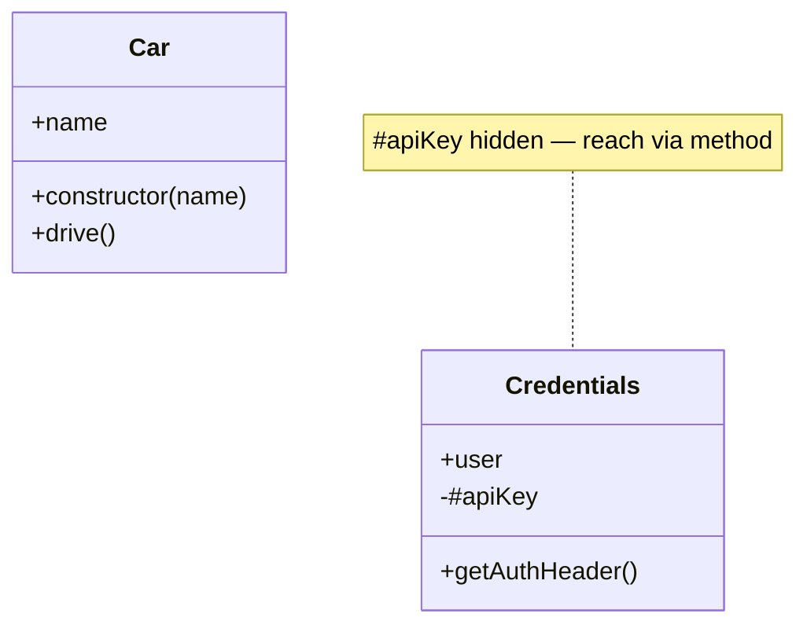

# Chapter 21 — Classes & Objects

The heart of OOP. A **class** is a blueprint; an **object** is one real thing built from it with `new`.

## Files

| File | Topic | What you'll learn |
|------|-------|-------------------|
| `171_Class_Object.js` | Class shape | Attributes (fields) + behaviour (methods) — the blueprint |
| `172_Class_Object2.js` | `new` + constructor | Constructor fires on `new`; object reference vs the object |
| `173_Car.js` | Parameterised constructor | Pass values into `new Car("Model S")`, store on `this.name` |
| `174_REAL_Browser.js` | Method vs function | A method is a function that lives inside a class |
| `175_IQ.js` | Per-object state | Each `new` makes its own `this` — independent fields |
| `176_Private_Public.js` | `#private` vs public | `#apiKey` is unreachable outside; expose via a method |
| `177_Statis.js` / `178_Statis.js` | `static` members | Class-level fields/methods — call on the class, not an instance |

## Concept

A class bundles **data** (fields) and the **behaviour** acting on it (methods) into one named unit. The `constructor` runs once at creation to seed `this`. `#name` fields are private; `static` members belong to the class itself.

## Why

This is exactly what a Page Object is — locators are fields, actions are methods. Private fields protect secrets (API keys); static members hold shared config.

## Q&A

- **Q: Constructor vs a normal method?** A: The `constructor` auto-runs once on `new` to initialise `this`. Normal methods run only when called.
- **Q: What does `#` do?** A: Marks a truly private field — `cred.#apiKey` outside the class throws; `cred.apiKey` is `undefined`. Reach it via a method.
- **Q: When `static`?** A: When the value belongs to the class, not any one object — `Student.mentor_name`, a shared counter, a factory helper.

## Mental model



## Code

```js
// 173_Car.js — blueprint + parameterised constructor + this
class Car {
  constructor(name) {
    this.name = name;        // runs once on `new`
  }
  drive() {                  // method = function inside a class
    console.log("i am driving", this.name);
  }
}
const tesla = new Car("Model S");
tesla.drive();               // i am driving Model S

// 176_Private_Public.js — #private vs public
class Credentials {
  #apiKey;
  constructor(user, key) {
    this.user = user;        // public
    this.#apiKey = key;
  }
  getAuthHeader() { return "Bearer " + this.#apiKey; }
}
const cred = new Credentials("admin", "secret_1234");
console.log(cred.getAuthHeader());  // Bearer secret_1234
```

## Run

```bash
node 173_Car.js
node 176_Private_Public.js
node 177_Statis.js
```