# Chapter 22 — Encapsulation

Hide internal data behind `#private` fields and expose it **only** through methods (getters/setters). The object guards its own state.

## Files

| File | Topic | What you'll learn |
|------|-------|-------------------|
| `179_Ecap.js` | Hide state | `#balance` is private; `deposit()` / `getBalance()` are the only doors |
| `180_REAK_EXAMPLE.js` | Getter / setter | Read `#child1` via `getChild1()`, change via `setChild1()` |
| `181_Ecap_Car.js` | Controlled access | `getEngine` / `setEngine` wrap a private `#engine` |
| `182_ECap_Bank.js` | Guarded setter | `setBalance` mutates only when `isCashier` — validation on write |

## Concept

Encapsulation = private field + public method gate. The method is where the **rules** live.

## Why

Outside code can't corrupt internals. A setter can validate (`if (amount > 0)`, `if (isCashier)`) before allowing a change — impossible if the field were public.

## Q&A

- **Q: Difference from just using `#`?** A: `#` is the mechanism; encapsulation is the pattern — private field + public method gate.
- **Q: Why a setter instead of a public field?** A: A setter can reject bad input. `182_ECap_Bank.js` blocks non-cashiers from changing the balance.
- **Q: Where in testing?** A: A Page Object hides its locators (`#usernameField`) and exposes `login()` — callers can't fiddle with selectors.

## Mental model

```mermaid
flowchart LR
    Caller -->|deposit&#40;100&#41;| M[public method]
    Caller -.->|"account.#balance ❌"| X[blocked]
    M -->|validates then writes| P["#balance (private)"]
    M -->|getBalance&#40;&#41;| Caller
    style P fill:#ffebee,stroke:#c62828
    style X fill:#ffebee,stroke:#c62828
```



## Code

```js
// 182_ECap_Bank.js — setter guards the write
class ICICI {
  #balance;
  constructor(name, balance) { this.name = name; this.#balance = balance; }
  getBalance() { return this.#balance; }
  setBalance(balance, isCashier) {
    if (isCashier) this.#balance = balance;
    else console.log("Not allowed");      // validation on write
  }
}
let acc = new ICICI("Pramod", 1000);
acc.setBalance(10000000, false);  // Not allowed
acc.setBalance(300000, true);     // ok — cashier
```

## Run

```bash
node 179_Ecap.js
node 182_ECap_Bank.js
```