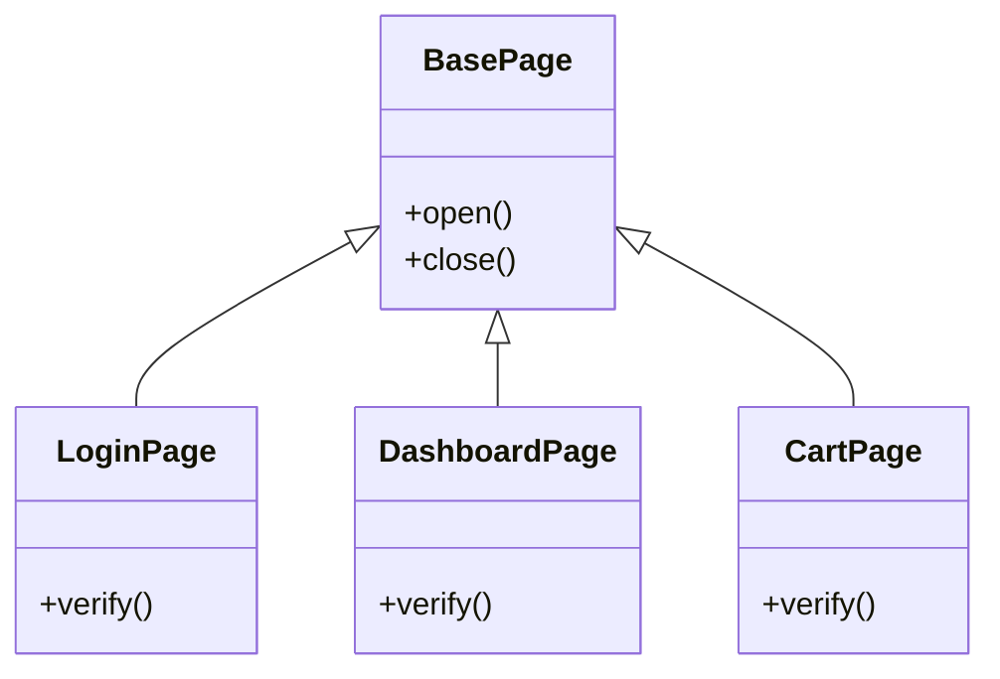

# Chapter 23 — Inheritance

A child class `extends` a parent — reusing its fields/methods, adding its own, optionally overriding. `super(...)` calls the parent constructor; `super.method()` calls the parent's method.

## Files

| File | Topic | What you'll learn |
|------|-------|-------------------|
| `183_Single_Inheritance.js` | `extends` | `LoginPage extends BasePage` — child reuses `open()`/`close()` |
| `184_SI_Example.js` | `super()` | `super(name)` runs the parent constructor first |
| `185_Single_Inheritance_Con.js` | Override | Child `setup()` replaces parent's |
| `186_IQ.js` | `super.method()` | Call the parent's version, then add to it |
| `187_IQ2.js` | Polymorphic loop | One array of subclasses, each `execute()` differs |
| `188_REAL_PageObject_Model.js` | Real POM | `BasePage` → `Login`/`Dashboard`/`Cart`, each `verify()` |
| `189_Multiple_Inheritance.js` | Not allowed | `extends A, B` is a `SyntaxError` in JS |
| `190_Multiple_Level_Inheritance.js` | Multi-level | `BasePage` → `AuthPage` → `AdminPage` |
| `191_Hierarchial_Inheritance.js` | Hierarchical | One parent, many children |

## Concept

Shared behaviour lives once in a base class; children specialise it.

## Why

Every Page Object inherits `open()`/`close()` from `BasePage` — write it once, reuse everywhere.

## Q&A

- **Q: `super()` vs `super.fn()`?** A: `super()` (in a constructor) runs the parent constructor. `super.fn()` calls the parent's method — used when you override but still want the parent's work.
- **Q: Multiple inheritance?** A: JS forbids `extends A, B`. Use multi-level (`A → B → C`) or composition.
- **Q: Override = lose the parent?** A: Only if you don't call `super.method()`. `186_IQ.js` calls `super.setup()` then adds steps.

## Mental model



## Code

```js
// 184_SI_Example.js — extends + super()
class Animal {
  constructor(name) { this.name = name; }
  eat() { console.log(this.name + " is eating"); }
}
class Dog extends Animal {
  constructor(name, breed) {
    super(name);          // parent constructor first
    this.breed = breed;
  }
  bark() { console.log(this.name + " is barking!"); }
}
const dog = new Dog("Rex", "Labrador");
dog.eat();   // inherited
dog.bark();  // own method

// 186_IQ.js — override but keep parent via super.method()
class UITest extends BaseTest {
  setup() {
    super.setup();                       // run parent's setup
    console.log("UI: maximize window");  // then add to it
  }
}
```

## Run

```bash
node 184_SI_Example.js
node 186_IQ.js
node 190_Multiple_Level_Inheritance.js
```